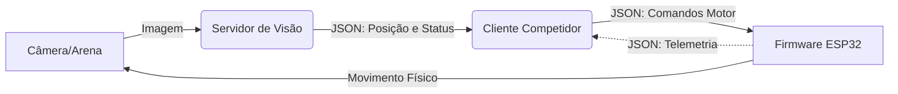

# 🏎️ Pac-Man Arena: Sistema de Robótica em Malha Fechada

Este projeto implementa um sistema de controle robótico distribuído para um jogo de arena real. A arquitetura baseia-se em um ciclo de **Malha Fechada Visual**, onde a posição dos robôs é detectada externamente, processada por um cliente competidor e convertida em comandos de atuação para o robô.

## 1\. 🔄 Arquitetura do Sistema

O sistema opera em um ciclo contínuo de **Sensoriamento -\> Decisão -\> Ação**:

1.  **Sensoriamento (Servidor de Visão):** Uma câmera capta a arena. O servidor processa a imagem, identifica os robôs e calcula suas coordenadas globais.
2.  **Decisão (Cliente Competidor):** O software do competidor recebe essas coordenadas via WebSocket. Ele compara a posição atual com o objetivo (estratégia de jogo) e calcula a correção necessária.
3.  **Ação (Firmware do Robô):** O cliente envia comandos de velocidade para o robô via WebSocket. O firmware recebe o comando e aciona os motores.
4.  **Feedback (Malha Fechada):** O robô se move, a câmera detecta a nova posição, e o ciclo se repete.

### Fluxo de Dados



-----

## 2\. 📂 Descrição dos Componentes

### A. O Sensor Global: `car_detector_ws.py`

Este é o "olho" e o juiz do sistema.

  * **Função:** Captura imagens da câmera, detecta as cores dos robôs (Pac-Man e Fantasmas) e gerencia as regras do jogo (pontuação, colisões, *power-ups*).
  * **Saída:** Transmite via WebSocket (Porta 8765) um JSON contendo o `estado_jogo` e a lista de `objetos` com suas coordenadas globais (x, y) e ângulo.

### B. O Controlador: `client_pacman_control.py`

Este é o "cérebro" da equipe.

  * **Conexão Dupla:**
      * *Escuta* o Servidor de Visão para saber onde está (`ws://ip_servidor:8765`).
      * *Fala* com o Firmware do Robô para enviar comandos (`ws://ip_robo:81`).
  * **Lógica:** Implementa o algoritmo de controle (ex: PID ou Lógica Fuzzy). Ele calcula o erro entre a posição atual (vinda da visão) e o alvo, gerando comandos de velocidade para os motores esquerdo e direito.

### C. O Atuador: `esp32_websocket.ino`

Este é o firmware embarcado no ESP32 do robô.

  * [cite\_start]**Servidor WebSocket:** O robô age como um servidor na porta **81**, aguardando a conexão do cliente[cite: 5].
  * **Segurança de Conexão:** Implementa um filtro de IP para garantir que apenas o computador autorizado controle o robô. [cite\_start]Ele aceita um IP Fixo definido ou o primeiro IP dinâmico que se conectar, bloqueando intrusos [cite: 2, 21-28].
  * [cite\_start]**Hardware:** Controla a Ponte H dos motores e lê sensores (ultrassônico e infravermelho) [cite: 11-12, 38-41].
  * [cite\_start]**Telemetria:** Envia de volta para o cliente dados locais que a câmera não vê, como distância de obstáculos à frente [cite: 42-43].

-----

## 3\. 📡 Protocolos de Comunicação (WebSocket - JSON)

### 1\. Visão -\> Cliente (Estado do Jogo)

Este pacote JSON é gerado pelo servidor de visão e consumido pelo cliente para duas funções: **renderizar a interface gráfica** e **calcular a lógica de controle** dos robôs.

Ele é dividido em três seções principais:

#### 1. `objetos` (Rastreamento Visual)
Lista contendo a posição e orientação de cada entidade (robô) detectada na arena.
* **`personagem`**: Identificador único do robô (ex: `"pac-man"`, `"fantasma_4"`). O cliente usa isso para saber qual robô ele deve controlar.
* **`x_global` / `y_global`**: Coordenadas absolutas (em pixels) do robô na imagem completa da câmera. Estas são as coordenadas usadas pelo cliente para calcular distâncias e desenhar na tela.
* **`x_arena` / `y_arena`**: Coordenadas relativas à área de recorte (ROI - Region of Interest). Úteis para depuração da visão computacional.
* **`angulo_graus`**: A orientação da frente do robô (0 a 360 graus). Essencial para o algoritmo de navegação saber para onde o robô está apontando antes de girar.

#### 2. `estado_jogo` (Regras e Status)
Variáveis globais que definem o comportamento da partida. O cliente usa isso para decidir, por exemplo, se deve fugir ou perseguir.
* **`paused`**: (`true`/`false`) Se verdadeiro, o jogo está parado (início ou pós-colisão). O cliente deve enviar velocidade zero para os motores.
* **`power_active`**: (`true`/`false`) Indica se o Pac-Man comeu uma "Power Pellet".
    * *Se `true`:* Pac-Man persegue, Fantasmas fogem.
    * *Se `false`:* Pac-Man foge, Fantasmas perseguem.
* **`time_remaining`**: Tempo restante da partida em segundos. Se chegar a zero, `game_over` torna-se `true`.
* **`lives`**: Quantidade de vidas restantes do Pac-Man.
* **`score`**: Pontuação atual acumulada.
* **`immunity`**: (`true`/`false`) Período temporário onde colisões são ignoradas (geralmente após um reset de posição).

#### 3. `coletas` (Itens da Arena)
Mapeamento de todos os "gatilhos" virtuais desenhados na arena e seu estado atual.
* O objeto é dividido em categorias: `power` (Super Força), `speed` (Velocidade) e `score` (Pontos).
* Cada chave (ex: `"score_1"`) possui um valor booleano:
    * **`false`**: O item está disponível na arena (o cliente desenha o item).
    * **`true`**: O item já foi coletado por um jogador (o cliente esconde o item e o servidor ignora novas passagens por ali).

#### Exemplo de uma mensagem JSON enviada pelo Servidor

```json
{
   "objetos":[
      {
         "personagem":"pac-man",
         "x_arena":47,
         "y_arena":155,
         "angulo_graus":78.62,
         "x_global":486,
         "y_global":424
      },
      {
         "personagem":"fantasma_1",
         "x_arena":370,
         "y_arena":105,
         "angulo_graus":63.29,
         "x_global":809,
         "y_global":374
      },
      {
         "personagem":"fantasma_2",
         "x_arena":370,
         "y_arena":105,
         "angulo_graus":63.29,
         "x_global":809,
         "y_global":374
      },
      {
         "personagem":"fantasma_3",
         "x_arena":370,
         "y_arena":105,
         "angulo_graus":63.29,
         "x_global":809,
         "y_global":374
      },
      {
         "personagem":"fantasma_4",
         "x_arena":370,
         "y_arena":105,
         "angulo_graus":63.29,
         "x_global":809,
         "y_global":374
      }
   ],
   "estado_jogo":{
      "paused":false,
      "game_over":false,
      "time_remaining":174.5,
      "lives":3,
      "score":10,
      "power_active":false,
      "speed_active":false,
      "power_timer":0.0,
      "speed_timer":0.0,
      "immunity":false
   },
   "coletas":{
      "power":{
         "power_1":true,
         "power_2":false,
         "power_3":false,
         "power_4":false
      },
      "speed":{
         "speed_boost_1":false,
         "speed_boost_2":false,
         "speed_boost_3":true,
         "speed_boost_4":false
      },
      "score":{
         "score_1":false,
         "score_2":true,
         "score_3":false,
         "score_4":false,
         "score_5":false,
         "score_6":false,
         "score_7":false,
         "score_8":false
      }
   }
}
```

### 2\. Cliente -\> Firmware (Comando de Ação)

O cliente envia os valores de PWM (0 a 255) para os motores. [cite\_start]O firmware recebe este JSON e ajusta a potência das rodas [cite: 31-33].

```json
{
  "motor1_vel": 200,   // Velocidade Motor Esquerdo (-150 a 150 com SPEED BOOD = False e -255 a 255 com SPEED BOOST = True)
  "motor2_vel": -180   // Velocidade Motor Direito (-150 a 150 com SPEED BOOD = False e -255 a 255 com SPEED BOOST = True)
}
```

### 3\. Firmware -\> Cliente (Telemetria)

O robô retorna a confirmação do valor configurado em cada motor. Serve como confirmação que o valor enviado foi configurado. O robô poderá enviar outros dados, como valores de sensores, mas estes devem ser IGNORADOS, pois nesta versão do Hackathon não foi possível implementar estas funcionalidades.

```json
{
  "motor1": { "vel": 200 },
  "motor2": { "vel": -180 },
  "presenca": {
    "esq": 1,    //IGNORAR
    "dir": 0,    //IGNORAR
    "tras": 1    //IGNORAR
  },
  "distancia_cm": 15.5  // IGNORAR
}
```

-----

## 4\. 🔧 Configuração e Segurança do Robô

O firmware (`esp32_websocket.ino`) possui recursos avançados para competição:

  * **Filtro de IP:** O sistema foi projetado para evitar sequestro de robôs. [cite\_start]Ele permite conexão apenas de um IP Fixo configurado (`FIXED_IP_CONFIG`) [cite: 2] [cite\_start]ou do primeiro cliente que ocupar o "Slot Dinâmico"[cite: 3].
  * [cite\_start]**Persistência:** Parâmetros de calibração dos motores (ganho e offset) são salvos na memória não volátil (Preferences), permitindo ajuste fino sem reprogramar [cite: 29-30].
  * [cite\_start]**Calibração:** O firmware aplica matematicamente ganhos e offsets aos comandos recebidos para corrigir diferenças físicas entre os motores antes de aplicar a energia [cite: 36-37].


# ⚽ Rocket League Arena: Futebol de Robôs Autônomos

Este projeto implementa um sistema de futebol robótico em malha fechada. Utilizando visão computacional, o sistema rastreia dois robôs e uma bola em tempo real, permitindo que clientes (computadores dos competidores) desenvolvam estratégias autônomas para empurrar a bola para o gol adversário.

## 1\. 🔄 Arquitetura do Sistema

O sistema funciona em um ciclo contínuo de percepção e ação, onde o servidor de visão atua como o juiz e o GPS da partida.

1.  **Sensoriamento (Servidor de Visão):** Uma câmera no teto capta o campo. O servidor processa a imagem para encontrar os jogadores e a bola, além de verificar se houve gol.
2.  **Estratégia (Cliente Competidor):** O software do competidor recebe as coordenadas. A lógica aqui é geométrica: calcular o ângulo necessário para alinhar o Robô com a Bola e o Gol adversário.
3.  **Ação (Robô):** O firmware recebe comandos de velocidade e move o robô fisicamente.

### Fluxo de Dados


-----

## 2\. 📂 Descrição dos Componentes

### A. O Juiz Eletrônico: `rocket-league_v2.py`

Este é o servidor central da arena. Diferente do Pac-Man, aqui o foco é a física da bola e a detecção de gols.

  * **Rastreamento:** Identifica 3 objetos principais por cor: `carro_1`, `carro_2` e `bola`.
  * **Arbitragem (Gols):**
      * Monitora duas áreas de interesse (ROIs): `GOL_1` (Time Azul) e `GOL_2` (Time Vermelho).
      * Se a bola entra em um ROI, o placar é atualizado na tela do servidor.
  * **Controle de Fluxo:**
      * **Pausa Automática:** Assim que um gol é marcado, o sistema "congela" e exibe o placar, aguardando que um humano reposicione os robôs e pressione a tecla **ESPAÇO** para retomar a partida.
      * **Cooldown:** Existe um temporizador de segurança (`GOAL_COOLDOWN_FRAMES`) para evitar que o mesmo gol seja contado múltiplas vezes enquanto a bola está dentro da rede.

### B. O Cliente Estratégico (Seu Código)

*Atua como o "Cérebro".*
Neste jogo, a estratégia é puramente vetorial. O cliente deve:

1.  Ler a posição da `bola`.
2.  Ler a posição do `seu_gol_alvo`.
3.  Calcular uma rota de interceptação para bater na bola na direção certa.

### C. O Robô (Firmware)

*Atua como os "Músculos".*
Recebe comandos simples de velocidade (Motor Esquerdo / Motor Direito) para executar as manobras de ataque e defesa.

-----

## 3\. 📡 Protocolo de Dados (JSON)

Nesta versão do Rocket League, o protocolo é mais leve. O servidor foca em enviar a **telemetria pura** das posições. O estado do jogo (placar e pausas) é gerenciado visualmente na tela do servidor, enquanto os robôs recebem dados contínuos de navegação.

### JSON Enviado pelo Servidor (`rocket-league_v2.py`)

O servidor envia uma **Lista de Objetos**. Não há separação de "estado de jogo" no JSON, apenas a física bruta.

```json
[
   {
      "personagem":"bola",
      "x_arena":204,
      "y_arena":174,
      "x_global":643,
      "y_global":401,
      "angulo_graus":272.49
   },
   {
      "personagem":"carro_1",
      "x_arena":379,
      "y_arena":9,
      "x_global":818,
      "y_global":236,
      "angulo_graus":15.07
   },
   {
      "personagem":"carro_2",
      "x_arena":379,
      "y_arena":9,
      "x_global":818,
      "y_global":236,
      "angulo_graus":15.07
   }
]
```

### 4\. Firmware -\> Cliente (Telemetria)

O robô retorna a confirmação do valor configurado em cada motor. Serve como confirmação que o valor enviado foi configurado. O robô poderá enviar outros dados, como valores de sensores, mas estes devem ser IGNORADOS, pois nesta versão do Hackathon não foi possível implementar estas funcionalidades.

```json
{
  "motor1": { "vel": 200 },
  "motor2": { "vel": -180 },
  "presenca": {
    "esq": 1,    //IGNORAR
    "dir": 0,    //IGNORAR
    "tras": 1    //IGNORAR
  },
  "distancia_cm": 15.5  // IGNORAR
}
```

-----

### Detalhamento dos Campos

  * **Lista `[]`**: O JSON raiz é um *array*. Cada elemento é um objeto detectado.
  * **`personagem`**: O identificador configurado no arquivo `calibracao_camera_rocket_league.json`. Geralmente:
      * `"bola"`: O objeto a ser perseguido.
      * `"carro_1"` / `"carro_2"`: Os robôs competidores.
  * **`x_global` / `y_global`**: Posição absoluta em pixels na imagem da câmera (1280x720). É usada para calcular distâncias e vetores.
  * **`angulo_graus`**: A orientação da frente do robô.
      * *Nota:* Para a bola, o ângulo pode ser ignorado (ou ser 0.0), pois ela é esférica, mas para os robôs é crucial para saber como girar para chutar.

-----

## 5\. 🎮 Regras da Lógica de Controle

Para fechar a malha de controle neste jogo, o cliente deve implementar a seguinte lógica básica:

1.  **Identificar Alvos:**
      * Se sou `carro_1` (ex: Lado Esquerdo), meu alvo é chutar a `bola` para dentro do `GOL_2` (Lado Direito).
2.  **Navegação:**
      * Diferente do Pac-Man (fuga/caça), aqui a navegação é de **Interceptação**.
      * O robô não deve ir diretamente para a bola; ele deve ir para um ponto *atrás* da bola, alinhado com o gol, para poder empurrá-la.
3.  **Pausa:**
      * Quando ocorre um gol, o servidor congela a imagem e para de atualizar posições logicamente na tela, mas o WebSocket continua enviando a última posição conhecida ou dados vazios. O cliente deve estar preparado para parar os motores se perceber que o jogo "travou" visualmente ou se implementado um comando manual de parada.
# hackatoon-pythonfloripa-ifsc

